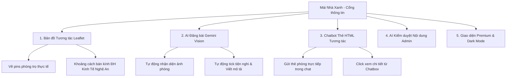

# Mái Nhà Xanh — Kế Hoạch Nâng Cấp Hệ Thống Toàn Diện (Chuẩn Quốc Gia)

Dưới đây là đánh giá chi tiết về hệ thống hiện tại của dự án **Mái Nhà Xanh** và đề xuất các phương án tích hợp công nghệ hiện đại, nâng tầm giao diện & trải nghiệm người dùng (UI/UX) nhằm sẵn sàng tối đa cho cuộc thi cấp Quốc gia.

---

## ĐÁNH GIÁ HỆ THỐNG HIỆN TẠI (CURRENT STATE EVALUATION)

Qua việc kiểm tra toàn bộ mã nguồn của dự án, hệ thống đang có nền tảng tốt (tích hợp PWA cài đặt ứng dụng, thông báo đẩy OneSignal, chatbot Groq Llama 3 siêu tốc, admin dashboard quản trị đầy đủ). Tuy nhiên, để dự thi cấp Quốc gia, hệ thống vẫn còn một số điểm hạn chế và cần được nâng cấp:

1. **Bản đồ tĩnh (Basic Iframe):** Trang `phong-tro.php` đang sử dụng một iframe Google Maps tĩnh, trỏ cứng tới một địa điểm (Trường Đại học Kinh tế Nghệ An). Bản đồ này hoàn toàn không tương tác, không hiển thị vị trí các phòng trọ thực tế trên bản đồ.
2. **Quy trình đăng bài thủ công (Manual Flow):** Người dùng phải tự điền thủ công tiêu đề, giá, diện tích, viết mô tả và tick chọn từng tiện nghi một cách nhàm chán. Chưa tận dụng được thế mạnh của AI đa phương thức (Multimodal Vision).
3. **Chatbot phản hồi dạng văn bản thuần (Text-only Chatbot):** Khi người dùng hỏi tìm phòng trọ, chatbot chỉ liệt kê bằng văn bản thô kệch hoặc danh sách bullet points, chưa hiển thị trực quan các thẻ phòng trọ (Room Cards) kèm hình ảnh, mức giá và nút đặt phòng trực tiếp trong khung chat.
4. **Quản trị viên duyệt bài thủ công (No AI Assistant):** Admin phải tự đọc mô tả, tự nhìn hình ảnh để đánh giá xem bài đăng có vi phạm chính sách hay không. Chưa có AI hỗ trợ kiểm duyệt nội dung tự động để gắn cờ cảnh báo (Flagging).
5. **Giao diện cơ bản:** Phong cách thiết kế vẫn ở mức truyền thống, thiếu các micro-interaction hiện đại, chưa có Dark Mode (hoặc Dark Mode chưa tối ưu trải nghiệm), và thiếu các hiệu ứng mượt mà (chuyển trang dạng SPA, Skeleton loaders).

---

## PHƯƠNG ÁN NÂNG CẤP & TÍCH HỢP HIỆN ĐẠI (PROPOSED ARCHITECTURE)

Dưới đây là 5 phương án tích hợp và nâng cấp hiện đại, mang tính ứng dụng thực tiễn cao để thuyết phục Ban giám khảo cấp Quốc gia:

### 1. Bản đồ tương tác thông minh (Leaflet & OpenStreetMap)

Thay thế iframe tĩnh bằng một bản đồ tương tác thực tế:

- **Hiển thị Marker:** Lấy tọa độ (lat/lng) của các phòng trọ từ Database để vẽ các Pin xanh/đỏ sinh động trên bản đồ.
- **Popup Overlays:** Nhấp vào Pin sẽ hiện một cửa sổ nhỏ (Card thu nhỏ) gồm ảnh phòng, tiêu đề, giá tiền và nút _Xem nhanh_.
- **Marker Clustering:** Tự động nhóm các phòng trọ ở gần nhau thành một vòng tròn hiển thị số lượng (tránh rối mắt khi mật độ cao).
- **University Distance Finder:** Vẽ vòng tròn bán kính (1km, 2km) xung quanh Đại học Vinh hoặc Đại học Sư phạm Kỹ thuật Vinh để sinh viên dễ dàng định vị các phòng trong bán kính đi bộ.

### 2. Trợ lý AI tự động điền thông tin đăng bài (Gemini-2.5-Flash Multimodal)

Tích hợp tính năng đăng bài bằng AI (1-Click AI Auto-fill):

- Khi chủ nhà đăng phòng trọ và tải ảnh lên ở `dang-bai.php`, hệ thống sẽ kích hoạt một nút **"Tự động điền nhanh bằng AI ✨"**.
- Ảnh phòng trọ sẽ được gửi đến API Gemini để phân tích:
  - **Phát hiện tiện nghi:** Tự động check các ô: Máy lạnh, Nóng lạnh, Giường, Tủ quần áo, v.v... dựa trên những vật dụng xuất hiện trong ảnh.
  - **Ước lượng diện tích:** Nhận diện không gian để dự đoán diện tích (khoảng 20m², 30m²).
  - **Tự động soạn mô tả:** Viết một đoạn mô tả hấp dẫn, chuyên nghiệp bằng tiếng Việt mô tả đúng tình trạng phòng (Ví dụ: _"Phòng trọ mới, ban công thoáng mát, đầy đủ ánh sáng, đi kèm giường gỗ..."_).
  - **Tạo tiêu đề thu hút:** Sinh tiêu đề tối ưu SEO như _"Phòng trọ khép kín đầy đủ tiện nghi gần ĐH Kinh Tế Nghệ An"_.

### 3. Chatbot nhúng thẻ phòng trọ trực quan (Smart Chat UI)

Nâng cấp Chatbot AI Groq Llama 3 hiện tại:

- **Tích hợp HTML Cards:** Khi người dùng hỏi _"Tôi muốn tìm phòng dưới 2 triệu có máy lạnh"_, AI không chỉ nói mà sẽ gửi kèm các thẻ phòng trọ HTML hiển thị trực quan (có ảnh phòng, giá, diện tích).
- **Tương tác trực tiếp:** Người dùng có thể click vào thẻ phòng ngay trong khung chat để mở Modal chi tiết hoặc nhấn gọi chủ nhà.
- **Voice Search Visualizer:** Khi người dùng nhấn giữ nút Mic để tìm phòng bằng giọng nói, sẽ hiển thị một hiệu ứng sóng âm (Waveform animation) chuyển động sinh động bằng HTML Canvas.

### 4. Hệ thống AI kiểm duyệt & Đánh giá rủi ro bài đăng cho Admin

- Khi bài viết được gửi lên ở trạng thái **"Chờ duyệt"**, hệ thống sẽ tự động chạy ngầm Gemini API để kiểm duyệt nội dung bài đăng:
  - Phát hiện hình ảnh nhạy cảm, không phải ảnh phòng trọ thực tế.
  - Phát hiện tin tuyển dụng lừa đảo, ngôn từ không phù hợp.
  - Tính toán **AI Safety Score** (Điểm tin cậy: 0-100%).
- Trên Admin Dashboard (`admin/posts.php`), bài viết sẽ hiển thị một Badge của AI: **"AI Khuyên: Duyệt ✅ (Tin cậy 95%)"** hoặc **"AI Khuyên: Từ chối ⚠️ (Ảnh không phù hợp)"** giúp Admin duyệt bài nhanh chóng và an toàn hơn.

### 5. Thiết kế Premium Dark Mode & Trải nghiệm Micro-Animations

- **Smooth Dark Mode:** Tích hợp bộ chuyển đổi chủ đề (Light/Dark Mode Switcher) sử dụng CSS Variables. Khi chuyển đổi, có một hiệu ứng chuyển động tròn (Circular clip-path transition) lan tỏa từ vị trí nút bấm cực kỳ mượt mà.
- **SPA-like Transitions:** Sử dụng JavaScript để nạp trang tĩnh mà không cần load lại toàn bộ website, kết hợp Skeleton Loader (màn hình chờ dạng khung xương mờ) để giao diện mượt mà giống như các ứng dụng React/NextJS hiện đại.
- **3D Card Hover Effect:** Các thẻ phòng trọ sẽ có hiệu ứng nghiêng 3D nhẹ (Perspective Tilt) khi di chuột qua, tạo cảm giác cao cấp.

---

## CÁC FILE SẼ THAY ĐỔI / THÊM MỚI (PROPOSED CHANGES)

### [Component 1] Interactive Map (Bản đồ tương tác)

#### [MODIFY] [phong-tro.php](file:///c:/Users/Dai%20Thang/Downloads/mai-nha-xanh/phong-tro.php)

- Nhúng thư viện **Leaflet CSS/JS** từ CDN.
- Thay thế thẻ `<iframe>` tĩnh bằng một `
` có chiều cao 400px.
- Viết mã JavaScript để khởi tạo bản đồ, nạp danh sách tọa độ các phòng trọ từ PHP và vẽ marker lên bản đồ.
- Tích hợp bộ lọc trên bản đồ: Khi lọc phòng bằng sidebar, các marker không khớp sẽ tự động ẩn đi.

#### [MODIFY] [admin/posts.php](file:///c:/Users/Dai%20Thang/Downloads/mai-nha-xanh/admin/posts.php)

- Thêm hai trường nhập liệu tọa độ Kinh độ (lng) và Vĩ độ (lat) hoặc tích hợp bản đồ nhỏ click chọn vị trí khi sửa bài đăng.

#### [MODIFY] [dang-bai.php](file:///c:/Users/Dai%20Thang/Downloads/mai-nha-xanh/dang-bai.php)

- Thêm bản đồ nhỏ cho phép người đăng bài click chọn vị trí chính xác của phòng trọ để lấy tọa độ tự động (Geocoding đảo).

---

### [Component 2] AI Form Auto-fill (Đăng bài bằng AI)

#### [NEW] [ai_autofill.php](file:///c:/Users/Dai%20Thang/Downloads/mai-nha-xanh/api/ai_autofill.php)

- API nhận hình ảnh đã tải lên tạm thời, chuyển đổi sang Base64 và gọi API Gemini 2.5 Flash thông qua cURL.
- Prompt sẽ yêu cầu Gemini phân tích hình ảnh và trả về định dạng JSON nghiêm ngặt chứa: tiêu đề gợi ý, mô tả chi tiết, diện tích dự tính, danh sách tiện ích phát hiện được.

#### [MODIFY] [dang-bai.php](file:///c:/Users/Dai%20Thang/Downloads/mai-nha-xanh/dang-bai.php)

- Thêm một nút **"Điền nhanh bằng AI ✨"** nằm cạnh phần chọn ảnh.
- Tích hợp JavaScript để tự động gửi ảnh lên API `ai_autofill.php` và điền kết quả JSON trả về vào các trường input/checkbox tương ứng kèm hiệu ứng sáng lên (glow animation).

---

### [Component 3] AI Smart Chatbot & Room Cards

#### [MODIFY] [assets/js/assistant.js](file:///c:/Users/Dai%20Thang/Downloads/mai-nha-xanh/assets/js/assistant.js)

- Nâng cấp hàm `linkifyResponse(text)` để nhận diện các mã thẻ phòng đặc biệt do Llama 3/Gemini sinh ra (ví dụ: `[ROOM:id]`), tự động thay thế mã đó bằng cấu trúc HTML thẻ phòng trọ thu nhỏ (Room Card) gồm ảnh đại diện, giá, diện tích, vị trí và nút chi tiết.
- Cập nhật system prompt của Chatbot để AI biết cách chèn cú pháp `[ROOM:id]` khi đề xuất phòng trọ cho người dùng.

#### [MODIFY] [includes/chatbot.php](file:///c:/Users/Dai%20Thang/Downloads/mai-nha-xanh/includes/chatbot.php)

- Thêm hiệu ứng canvas hiển thị sóng âm khi nhấn giữ nút Microphone thu âm giọng nói.

---

### [Component 4] AI Post Moderation for Admins

#### [MODIFY] [api/dangbai.php](file:///c:/Users/Dai%20Thang/Downloads/mai-nha-xanh/api/dangbai.php)

- Khi người dùng gửi bài đăng thành công, hệ thống sẽ thực hiện gọi ngầm Gemini API phân tích nội dung văn bản và ảnh chính của phòng trọ.
- Lưu kết quả phân tích kiểm duyệt (Điểm an toàn, đánh giá rác/spam, phát hiện lừa đảo) vào cột mới `ai_check` trong bảng `dangbai_chothuetro`.

#### [MODIFY] [admin/posts.php](file:///c:/Users/Dai%20Thang/Downloads/mai-nha-xanh/admin/posts.php)

- Hiển thị thông tin đánh giá kiểm duyệt tự động từ AI ngay dưới bài viết đang chờ duyệt, giúp admin có gợi ý để click Duyệt hoặc Từ chối nhanh chóng.

---

### [Component 5] Premium Visual & Theme Switcher

#### [MODIFY] [includes/header.php](file:///c:/Users/Dai%20Thang/Downloads/mai-nha-xanh/includes/header.php)

- Thêm nút gạt **Light/Dark Mode** ở thanh Menu.
- Tích hợp CSS variables trong `style.css` để định nghĩa màu sắc cho cả 2 chế độ sáng và tối.

#### [MODIFY] [assets/css/style.css](file:///c:/Users/Dai%20Thang/Downloads/mai-nha-xanh/assets/css/style.css)

- Tái cấu trúc màu sắc sử dụng CSS custom properties (variables) hỗ trợ Dark Mode.
- Viết CSS cho hiệu ứng Circular Clip-path lan tỏa khi gạt đổi chế độ.
- Thêm class skeleton loader cho các thẻ phòng trọ trong quá trình tải dữ liệu.
- Thêm hiệu ứng Hover 3D nghiêng cho các thẻ phòng trọ.

---

## KẾ HOẠCH XÁC MINH (VERIFICATION PLAN)

### Kiểm thử tự động (Automated/Unit Tests)

1. **Kiểm tra API AI Auto-fill:**
   - Gửi request thử nghiệm đến `api/ai_autofill.php` kèm một ảnh phòng trọ mẫu, xác thực xem API có trả về đúng cấu trúc JSON mong muốn của các trường hay không.
2. **Kiểm tra Phản hồi Chatbot:**
   - Gửi câu hỏi tìm phòng mẫu qua bot chat, kiểm tra xem AI có sinh đúng mã thẻ phòng `[ROOM:id]` và frontend có render thành công thẻ phòng HTML hay không.

### Xác minh thủ công (Manual Verification)

1. **Kiểm tra Bản đồ tương tác:**
   - Mở trang Phòng trọ, đảm bảo bản đồ Leaflet load mượt mà, hiển thị đúng vị trí các phòng và có tương tác popup khi bấm vào.
   - Thử nghiệm bộ lọc khu vực để kiểm tra các Marker trên bản đồ có biến mất/xuất hiện tương ứng hay không.
2. **Kiểm tra Dark Mode:**
   - Bấm nút chuyển đổi Light/Dark Mode trên nhiều thiết bị (Chrome Desktop, Safari iOS) để kiểm chứng hiệu ứng lan tỏa clip-path và hiển thị độ tương phản chữ.
3. **Đăng bài bằng AI:**
   - Vào trang đăng bài, tải ảnh phòng ngủ thực tế lên, bấm "Điền nhanh bằng AI" để kiểm tra tốc độ phản hồi và độ chính xác của các checkbox tiện nghi.
