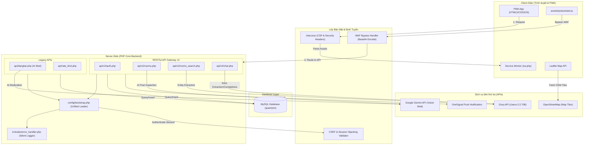
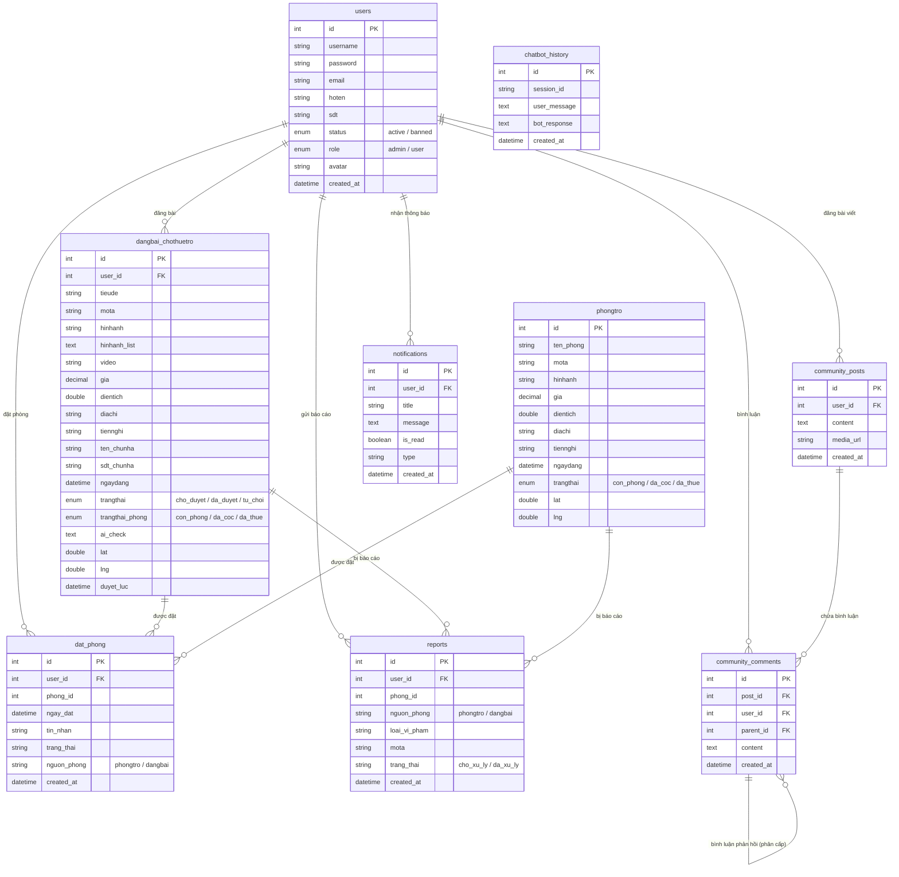
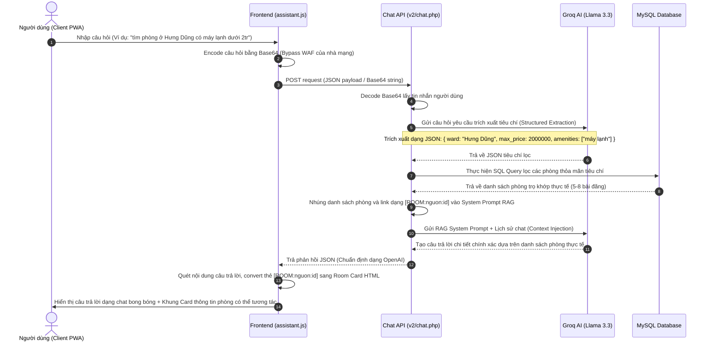
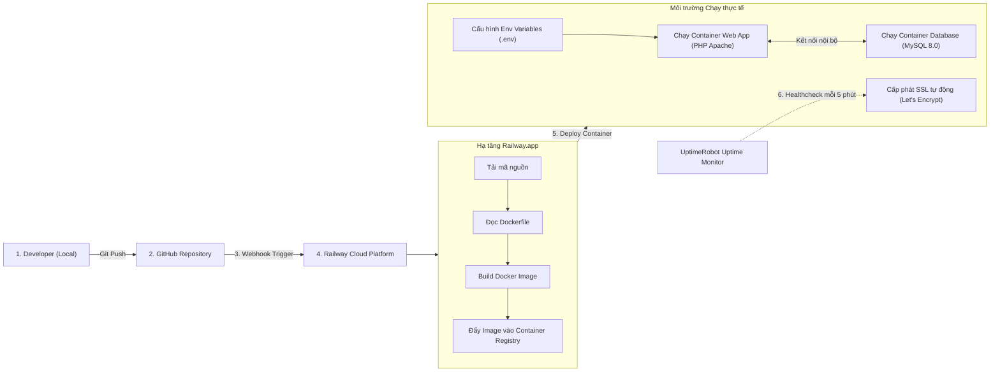

# Tài Liệu Đặc Tả Sơ Đồ Kiến Trúc Hệ Thống — Mái Nhà Xanh (Tuần 3)

Tài liệu này cung cấp toàn bộ các sơ đồ đặc tả kỹ thuật của hệ thống Mái Nhà Xanh phục vụ Kỳ thi Quốc gia. Các sơ đồ được vẽ trực quan bằng ngôn ngữ Mermaid.

---

## 1. Sơ Đồ Kiến Trúc Hệ Thống (System Architecture)

Sơ đồ mô tả luồng tương tác từ trình duyệt của người dùng (PWA Client) qua mạng internet, đi qua các lớp bảo mật, vào máy chủ PHP Apache và tương tác với cơ sở dữ liệu cùng các API dịch vụ bên thứ ba.

---

## 2. Sơ Đồ Thực Thể Cơ Sở Dữ Liệu (Database ERD)

Sơ đồ mô tả cấu trúc quan hệ thực thể (ERD) giữa 9 bảng dữ liệu cốt lõi trong hệ thống `quanlytro`.

---

## 3. Sơ Đồ Đường Ống AI & RAG Chatbot (AI Pipeline Flow)

Sơ đồ đặc tả chi tiết cách thức Chatbot hoạt động theo mô hình RAG (Retrieval-Augmented Generation) và tự động lọc dữ liệu an toàn.

---

## 4. Sơ Đồ Quy Trình Triển Khai & Vận Hành (CI/CD & Deployment)

Sơ đồ mô tả quy trình triển khai tự động từ máy lập trình viên qua nền tảng ảo hóa Docker lên máy chủ đám mây Railway:

